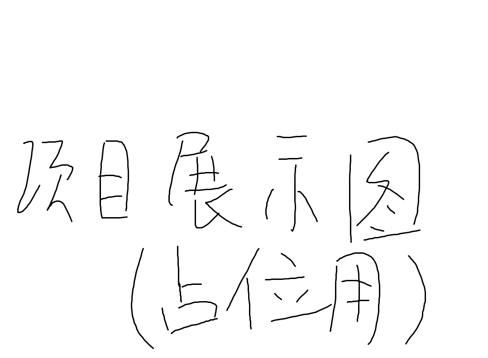

# Chunk Chain Game

([中文文档](/README_zh.md))

## Feature

(This can write some feature description)

## Requirements

(This can write some runtime requirements)

## Build

(This can write some method on how to build from the source)

## Contributing

(This can write some contributor congratulations)

## Contact

(This can write some technical contacts (email etc.))

